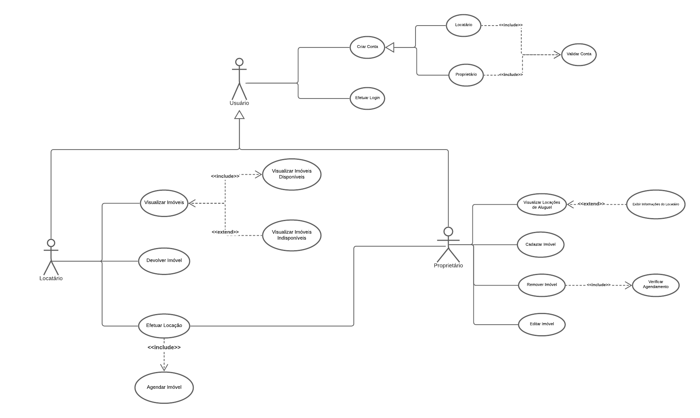
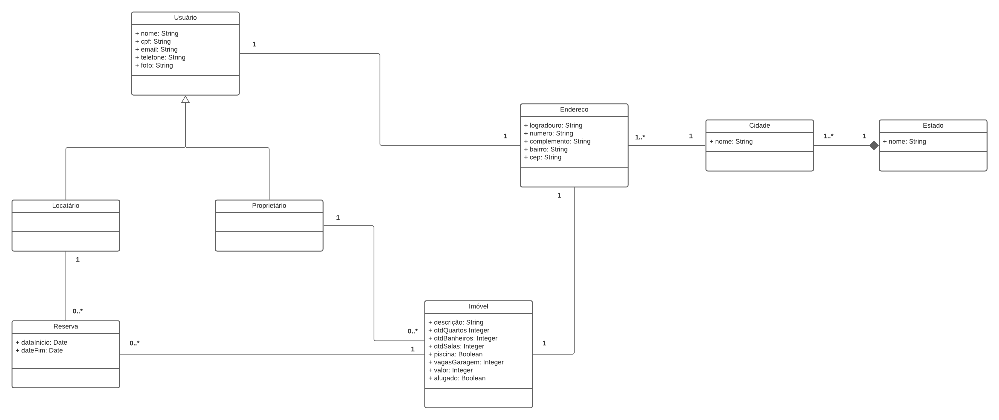

# AirbnbAnyLess
Trabalho desenvolvido para disciplina de Desenvolvimento de Software na Universidade Federal de Pelotas (UFPel-RS). O AirbnbAnyLess é "Tipo Airbnb". Um Sistema Web que disponibiliza aos seus usuários um lugar onde possam colocar seus imóveis para alugar/vender e alugar/comprar os imóveis disponíveis na plataforma.

## Requisitos do projeto
- [x] Sistema Web;
- [x] Banco de Dados Relacional;
- [ ] Linguagem orientada a objetos (no mínimo em aplicações do backend);
- [ ] Framework (disponível somente em frontend).

## Ferramentas selecionadas
- [MariaDB](https://mariadb.org);
- [Nodejs](https://nodejs.org/en/);
- [VUE or ReactJS].

## User stories
### Usuario
- [ ] Criar conta;
- [ ] Login;
- [ ] Solicitar limpeza.

### Usuário Locatário/Comprador
- [ ] Locar um imóvel;
- [ ] Comprar um imóvel;
- [ ] Devolver um imóvel.

### Usuário Proprietário
- [ ] Registrar um imóvel para locação;
- [ ] Registrar um imóvel para venda;
- [ ] Desaverbar um imóvel de locação;
- [ ] Desaverbar um imóvel de venda;
- [ ] Alterar situação do imóvel (venda/locação/ambos);
- [ ] Solicitar imóvel de volta.

## Links Importantes
- [Frontend design](https://www.figma.com/file/6qkOFYaCl58t0HABiNtkwv/AirbnbAnyLess?node-id=0%3A1)
- [Imagens de acesso/uso liberado](https://unsplash.com)

## Diagramas

---

### Diagrama de Casos de Uso

### Diagramas de Classes

### Diagrama Entidade Relacionamento

### Estrutura do Banco de Dados
