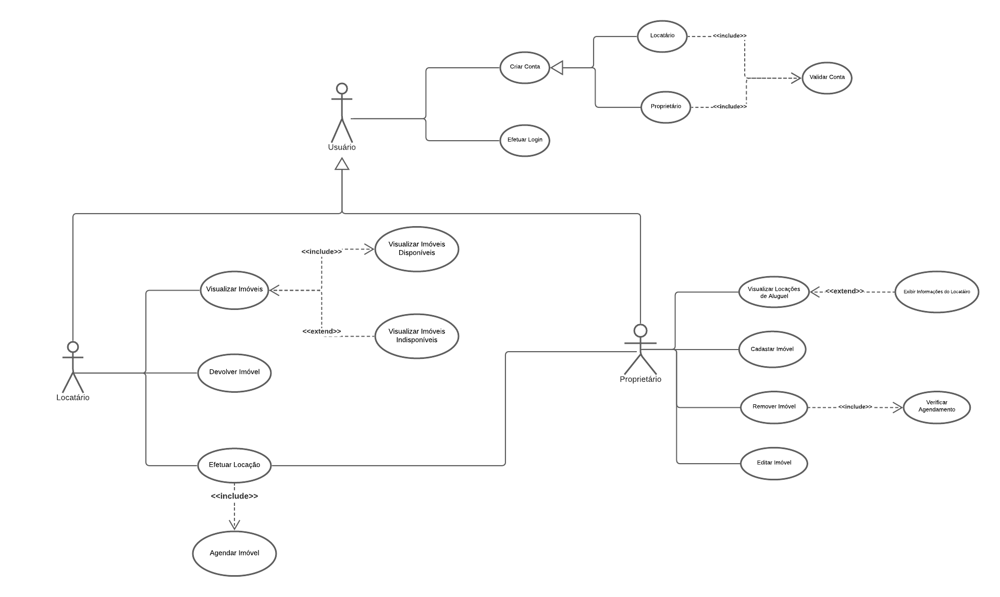
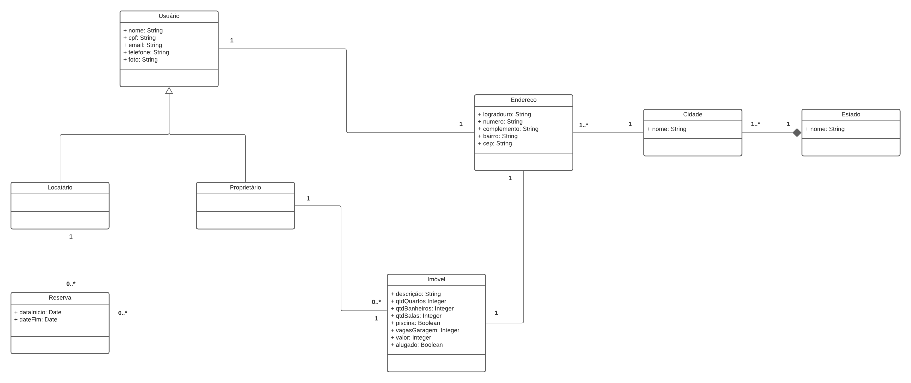
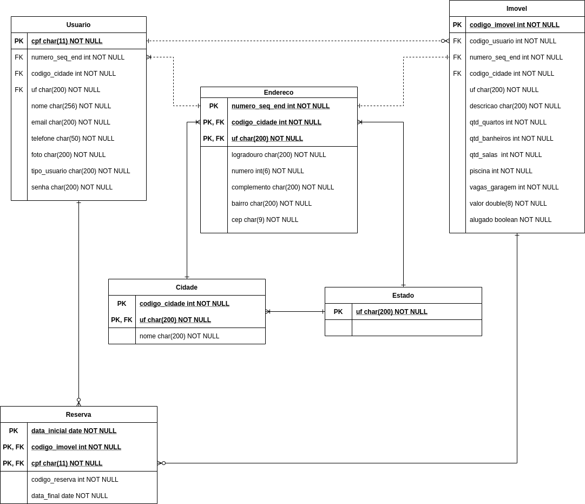

# AirbnbAnyLess
Trabalho desenvolvido para disciplina de Desenvolvimento de Software na Universidade Federal de Pelotas (UFPel-RS). O AirbnbAnyLess é "Tipo Airbnb". Um Sistema Web que disponibiliza aos seus usuários um lugar onde possam colocar seus imóveis para alugar/vender e alugar/comprar os imóveis disponíveis na plataforma.

# Instalação

1. Baixe o XAMPP: https://downloadsapachefriends.global.ssl.fastly.net/8.0.3/xampp-linux-x64-8.0.3-0-installer.run?from_af=true
2. No diretório do arquivo baixado, torne o arquivo um executável com: `sudo chmod -R 777 xampp-linux-x64-8.0.3-0-installer.run`
3. Para instalar o XAMPP: `sudo ./xampp-linux-x64-8.0.3-0-installer.run`
   - **OBS:** xampp-linux-x64-8.0.3-0-installer.run é o nome do arquivo baixado, caso seja outro no sistema de vocês, apenas modifique.
   - **OBS:** Execute com o `sudo` pois esse instalador necessita de privilégios do usuário root.
4. Após abrir o XAMPP, prossiga clicando em NEXT até concluir a instalação!
5. Para executar o XAMPP: `sudo /opt/lampp/xampp start`
   - Caso de erro de net-tools, instale: `sudo apt install net-tools`

# Configurando Diretório do Projeto

- Abra o arquivo localizado em `/opt/lampp/etc/httpd.conf`
- Procure `DocumentRoot "/opt/lampp/htdocs"`
  - Mude para seu diretório do projeto, exemplo: `"/home/thiagoheron/Documents/ufpel/DS/AirbnbAnyLess"`
- Procure `<Directory  "/opt/lampp/htdocs">`
  - Mude para `<Directory "/home/thiagoheron/Documents/ufpel/DS/AirbnbAnyLess">`
- Acesse: `http://localhost/phpmyadmin/`
- 

## Diagramas

---

### Diagrama de Casos de Uso

### Diagramas de Classes

### Estrutura do Banco de Dados
